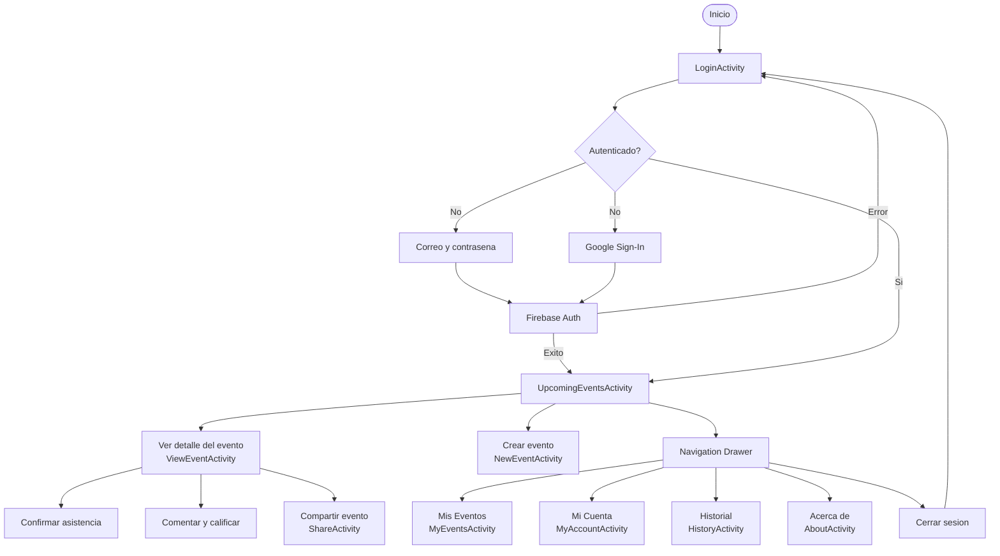
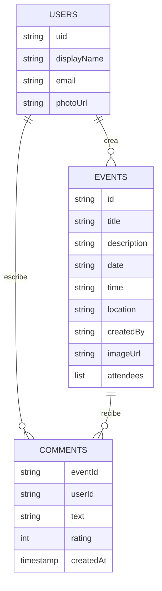

<p align="center">
  
</p>

<h1 align="center">UDBPlus</h1>

<p align="center">
  Aplicación móvil Android para la gestión de eventos y actividades comunitarias
</p>

<p align="center">
  
  
  
  
</p>

---

## Descripcion

UDBPlus es una aplicacion movil desarrollada en Android con Kotlin que permite a una comunidad gestionar eventos y actividades. Ofrece autenticacion segura, creacion y seguimiento de eventos, interaccion social mediante comentarios y calificaciones, y un historial de participacion por usuario.

---

## Integrantes

| Carnet | Nombre | Rol |
|---|---|---|
| ME221443 | Isidro Alexander Marroquin Echeverria | Programacion, Diseno, Logica, QA |

Materia: Desarrollo de Software para Moviles — DSM941 G01T

---

## Caracteristicas

- Autenticacion con correo/contrasena y Google Sign-In
- Creacion, edicion y eliminacion de eventos (titulo, descripcion, fecha, hora, ubicacion, imagen)
- Confirmacion de asistencia (RSVP)
- Comentarios con calificacion de estrellas
- Compartir eventos en redes sociales
- Historial de eventos pasados
- Mi Cuenta: actualizacion de correo y contrasena
- Navegacion lateral (Navigation Drawer)
- Soporte para modo oscuro y claro

---

## Arquitectura

La aplicacion sigue una arquitectura por capas basada en el patron **MVC adaptado a Android**, con separacion clara entre vistas (Activities/Layouts), modelos de datos y acceso a servicios remotos via Firebase.

```
com.udbvirtual.eventpulse
├── auth/               # Autenticacion (Login, SignUp)
├── management/         # Logica principal (eventos, cuenta, historial, about)
├── model/              # Modelos de datos (Event, Comment)
└── social/             # Funcionalidad de compartir
```

### Diagrama de flujo de la aplicacion



### Diagrama de datos en Firestore



---

## Tecnologias utilizadas

| Tecnologia | Version | Uso |
|---|---|---|
| Kotlin | 1.9 | Lenguaje principal |
| Android SDK | API 35 (min API 24) | Plataforma |
| Firebase Auth | 23.1.0 | Autenticacion |
| Firebase Firestore | 25.1.1 | Base de datos en tiempo real |
| Firebase Storage | 21.0.1 | Almacenamiento de imagenes |
| Google Play Services Auth | 21.2.0 | Google Sign-In |
| Glide | 4.15.1 | Carga y cache de imagenes |
| Material Components | 1.12.0 | UI/UX |
| ViewBinding | — | Acceso seguro a vistas |

---

## Requisitos previos

- Android Studio Hedgehog o superior (recomendado: Ladybug)
- JDK 21
- Android SDK con API 24 como minimo y API 35 como target
- Cuenta en [Firebase Console](https://console.firebase.google.com/) con un proyecto configurado
- Archivo `google-services.json` colocado en `app/`

---

## Instalacion y ejecucion

### 1. Clonar el repositorio

```bash
git clone https://github.com/marroquin9953/Proyecto-2---DSM941.git
cd "Proyecto-2---DSM941"
```

### 2. Configurar Firebase

1. Crea un proyecto en [Firebase Console](https://console.firebase.google.com/).
2. Registra la app con el package name `com.udbvirtual.eventpulse`.
3. Descarga el archivo `google-services.json` y colocalo en `app/google-services.json`.
4. Habilita en Firebase Console:
   - **Authentication** — metodos: Correo/Contrasena y Google
   - **Firestore Database** — modo produccion o prueba segun necesidad
   - **Storage** — para imagenes de eventos

### 3. Abrir en Android Studio

1. Abre Android Studio.
2. Selecciona **File > Open** y elige la carpeta del proyecto.
3. Espera a que Gradle sincronice las dependencias.

### 4. Ejecutar en dispositivo o emulador

**Desde Android Studio:**
- Conecta un dispositivo fisico con depuracion USB habilitada, o crea un AVD (emulador) desde **Device Manager**.
- Presiona el boton **Run** (triangulo verde) o usa el atajo `Shift + F10`.

**Desde la terminal (linea de comandos):**

```bash
# En Windows
gradlew.bat assembleDebug

# En Mac/Linux
./gradlew assembleDebug
```

El APK generado se encuentra en:
```
app/build/outputs/apk/debug/app-debug.apk
```

Para instalarlo directamente en un dispositivo conectado:

```bash
# Windows
gradlew.bat installDebug

# Mac/Linux
./gradlew installDebug
```

### 5. Verificar la configuracion del SDK local

Asegurate de que el archivo `local.properties` en la raiz del proyecto apunte correctamente al SDK de Android instalado en tu maquina:

```properties
sdk.dir=C\:\\Users\\TuUsuario\\AppData\\Local\\Android\\Sdk
```

---

## Estructura del proyecto

```
Proyecto-2---DSM941/
├── app/
│   ├── src/
│   │   └── main/
│   │       ├── java/com/udbvirtual/eventpulse/
│   │       │   ├── auth/
│   │       │   │   ├── LogInActivity.kt
│   │       │   │   └── SignUpActivity.kt
│   │       │   ├── management/
│   │       │   │   ├── AboutActivity.kt
│   │       │   │   ├── CommentsAdapter.kt
│   │       │   │   ├── EventsAdapter.kt
│   │       │   │   ├── HistoryActivity.kt
│   │       │   │   ├── MyAccountActivity.kt
│   │       │   │   ├── MyEventsActivity.kt
│   │       │   │   ├── NewEventActivity.kt
│   │       │   │   ├── UpcomingEventsActivity.kt
│   │       │   │   └── ViewEventActivity.kt
│   │       │   ├── model/
│   │       │   │   ├── Comment.kt
│   │       │   │   └── Event.kt
│   │       │   └── social/
│   │       │       └── ShareActivity.kt
│   │       ├── res/
│   │       │   ├── drawable/
│   │       │   ├── layout/
│   │       │   ├── menu/
│   │       │   └── values/
│   │       └── AndroidManifest.xml
│   ├── build.gradle.kts
│   └── google-services.json     <- no incluido en el repo
├── local.properties              <- no incluido en el repo
├── settings.gradle.kts
└── README.md
```

---

## Licencia

Este proyecto se distribuye bajo los terminos de la licencia incluida en el archivo [LICENSE](LICENSE).

---

<p align="center">
  Desarrollado por Isidro Alexander Marroquin Echeverria — ME221443<br>
  isidro.marroquin@udb.edu.sv
</p>
